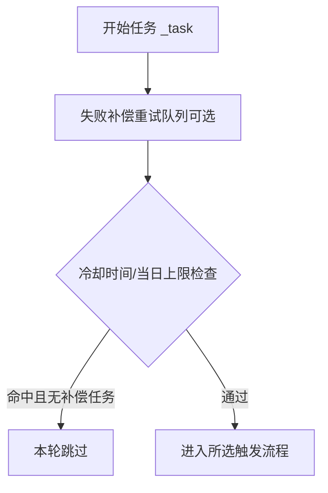
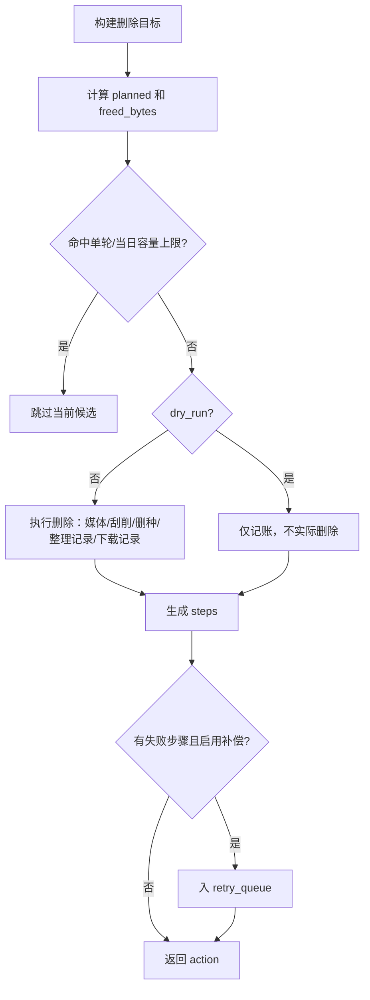
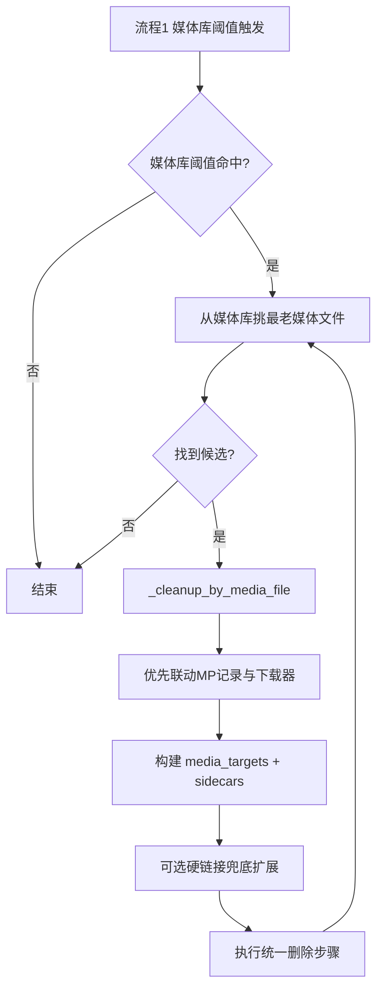
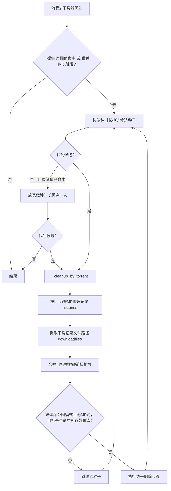
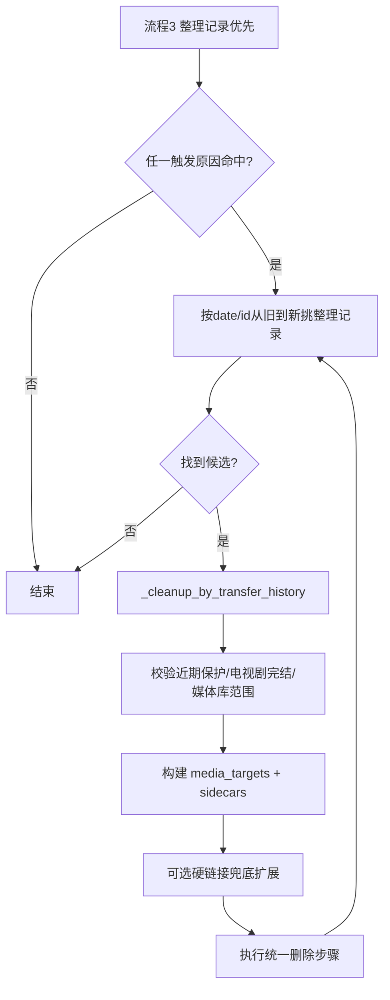

# 磁盘清理（DiskCleaner）使用说明

本文档说明插件三种触发模式的执行链路、关键判断关系与常见选择建议。

## 1. 模式总览

- 模式一：`flow_library_mp_downloader`（媒体优先，推荐）
- 模式二：`flow_downloader_mp_library`（下载器优先）
- 模式三：`flow_transfer_oldest`（整理记录优先，旧到新）

## 2. 判断关系（统一）

### 2.1 任务入口

### 2.2 统一删除步骤

## 3. 模式一：媒体优先（推荐）

关键点：

- 优先从媒体文件反查 MP 整理记录。
- 若开启“硬链接强制删除(兜底)”且缺失 MP 关联，可按同 inode 扩展删除目标。

## 4. 模式二：下载器优先

关键点：

- 可同时受“下载目录阈值”与“做种时长”驱动。
- 开启硬链接兜底时，允许无 MP 记录继续处理，并会从 `downloadfiles` 提取本地路径参与清理。

## 5. 模式三：整理记录优先（旧到新）

触发原因：

- 媒体库目录阈值命中；
- 下载目录阈值命中；
- 下载器做种时长触发（开启监控时）。

## 6. 重要开关与影响

- `force_hardlink_cleanup`：开启后会把下载目录加入删除根范围，并对媒体目标做同 inode 扩展（兜底策略）。
- `tv_complete_only`：仅清理已完结电视剧（依据 TMDB 状态）。
- `monitor_download`：启用下载目录空间阈值触发。
- `monitor_downloader` + `seeding_days`：启用下载器做种时长触发。
- `enable_retry_queue`：失败步骤进入补偿队列重试。

## 7. 选择建议

- 常规环境优先选“媒体优先”。
- 下载器占用明显高、希望从做种任务侧回收，选“下载器优先”。
- 需要严格按历史最旧记录清理，选“整理记录优先”。

