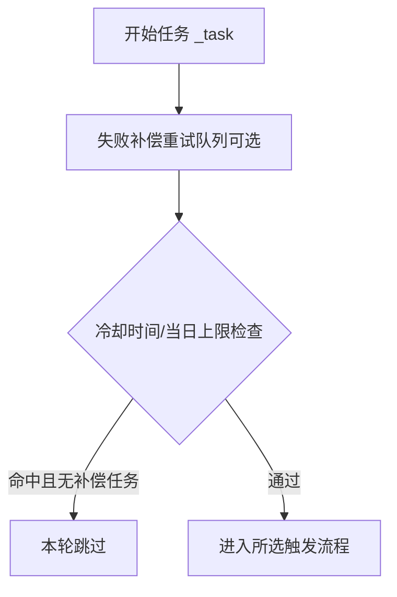
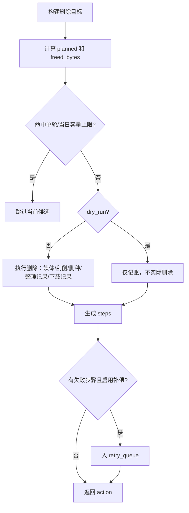
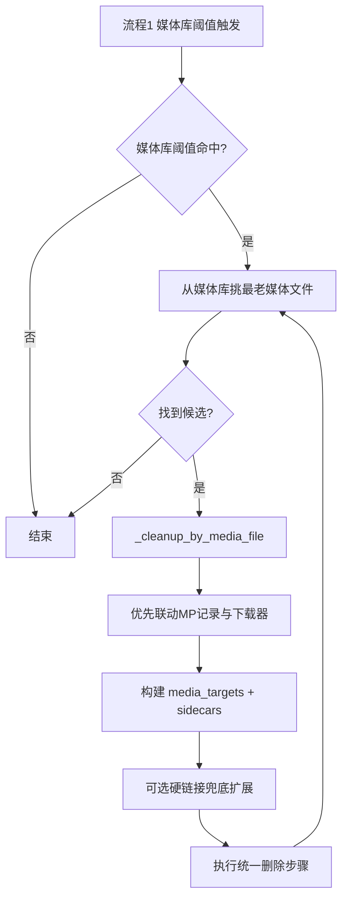
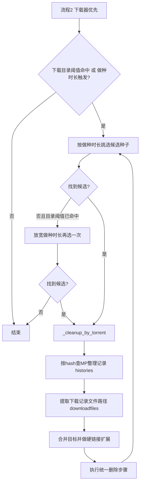
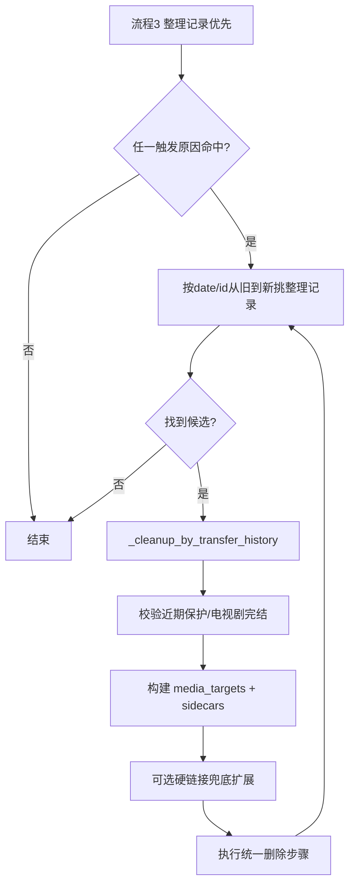

# 磁盘清理（DiskCleaner）使用说明

本文档面向 `v0.22+`，用于快速理解三种触发模式、关键判断关系、参数影响与日志排查方式。

## 1. 快速上手（推荐）

1. 首次使用建议开启 `dry_run`（演练）先观察日志。
2. 触发流程先选 `flow_library_mp_downloader`（媒体优先）。
3. 阈值建议：
   - 下载目录：`1000G` 或 `10%`
   - 媒体库目录：`1500G` 或 `15%`
4. 确认日志中出现：
   - `本轮空间检查 ...`
   - `流程1媒体候选扫描目录(...)`
   - `开始执行清理计划 ...`
5. 验证无误后关闭 `dry_run` 再执行真实删除。

## 2. 关键认知（避免误判）

- 空间阈值判定按 `GiB` 计算，UI里可能显示 `TB` 四舍五入。  
  例如可用 `1.00 TB` 可能是 `1025 GiB`，对 `1000G` 阈值仍属于“未命中”。
- `media_servers` / `media_libraries` 现在仅用于“刷新媒体库目标”，不再用于媒体目录路径过滤。
- 演练模式会“连续规划多条候选”，但不会实际释放空间，这是正常现象。

## 3. 模式总览

- 模式一：`flow_library_mp_downloader`（媒体优先，推荐）
- 模式二：`flow_downloader_mp_library`（下载器优先）
- 模式三：`flow_transfer_oldest`（整理记录优先，旧到新）

## 4. 统一执行关系

### 4.1 任务入口

### 4.2 统一删除步骤

## 5. 三种流程图

### 5.1 媒体优先（推荐）

### 5.2 下载器优先

### 5.3 整理记录优先（旧到新）

## 6. 关键参数关系

- `force_hardlink_cleanup`  
  开启后会把下载目录加入删除根范围，并对媒体目标做同 inode 扩展（兜底）。
- `tv_complete_only`  
  仅清理已完结电视剧（TMDB 状态判断）。
- `monitor_download` / `download_threshold_*`  
  资源目录空间告警触发。
- `monitor_library` / `library_threshold_*`  
  媒体库空间告警触发。
- `monitor_downloader` + `seeding_days`  
  下载器做种时长触发。
- `enable_retry_queue`  
  删除步骤失败后入补偿队列重试。
- `media_servers` / `media_libraries`  
  仅用于刷新媒体库目标，不参与清理路径过滤。

## 7. 日志判读（建议对照）

- `本轮空间检查 ...`：确认阈值是否命中（含可用 GiB）。
- `流程1媒体候选扫描目录(...)`：本轮实际扫描目录清单。
- `媒体候选扫描开始 ...`：目录与媒体扩展范围。
- `媒体候选扫描完成 ...`：候选总量/优先类型候选/最终选中目标。
- `开始执行清理计划 ...`：本条计划动作与预计释放容量。
- `流程1未找到可清理的媒体文件；...`：已附完整过滤统计摘要。

## 8. 常见问题排查

- 显示 `1.00 TB` 但“资源目录状态正常”  
  先看日志里的 `≈xxxx.xx GiB`，若大于阈值（如 `1000G`）则正常。
- 一直提示“未找到可清理媒体文件”  
  重点看扫描摘要中的：
  - 非媒体扩展过滤数
  - 近期保护过滤数
  - 未完结电视剧过滤数
  - 目录存在数与扫描文件数
- `未找到可删除的下载记录`  
  表示当前候选缺少下载历史映射，不影响媒体/刮削步骤执行。
- `Object of type MediaType is not JSON serializable`  
  属于旧版本问题，升级到 `v0.20+` 已修复。

## 9. 选择建议

- 常规环境：选“媒体优先”。
- 下载器占用明显高：选“下载器优先”。
- 需要按历史最旧清理：选“整理记录优先”。
